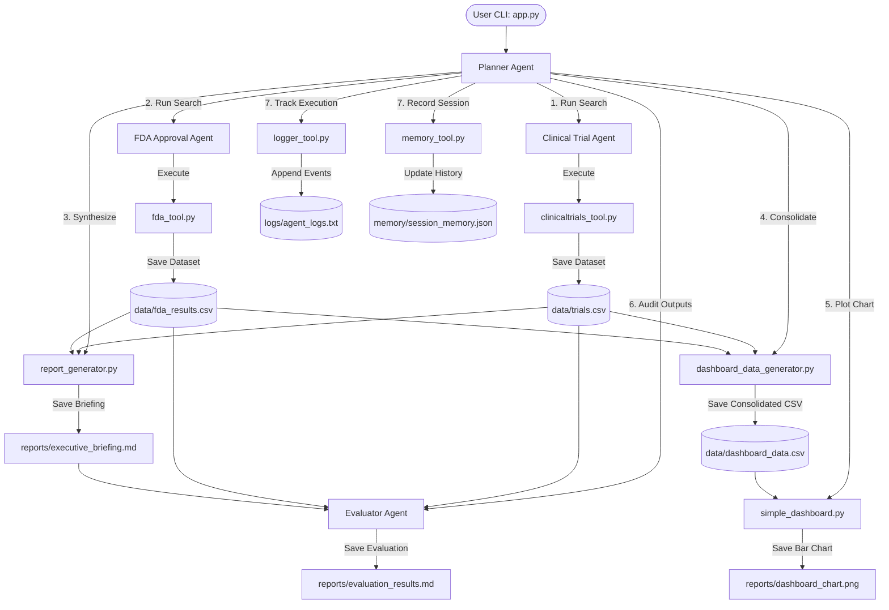
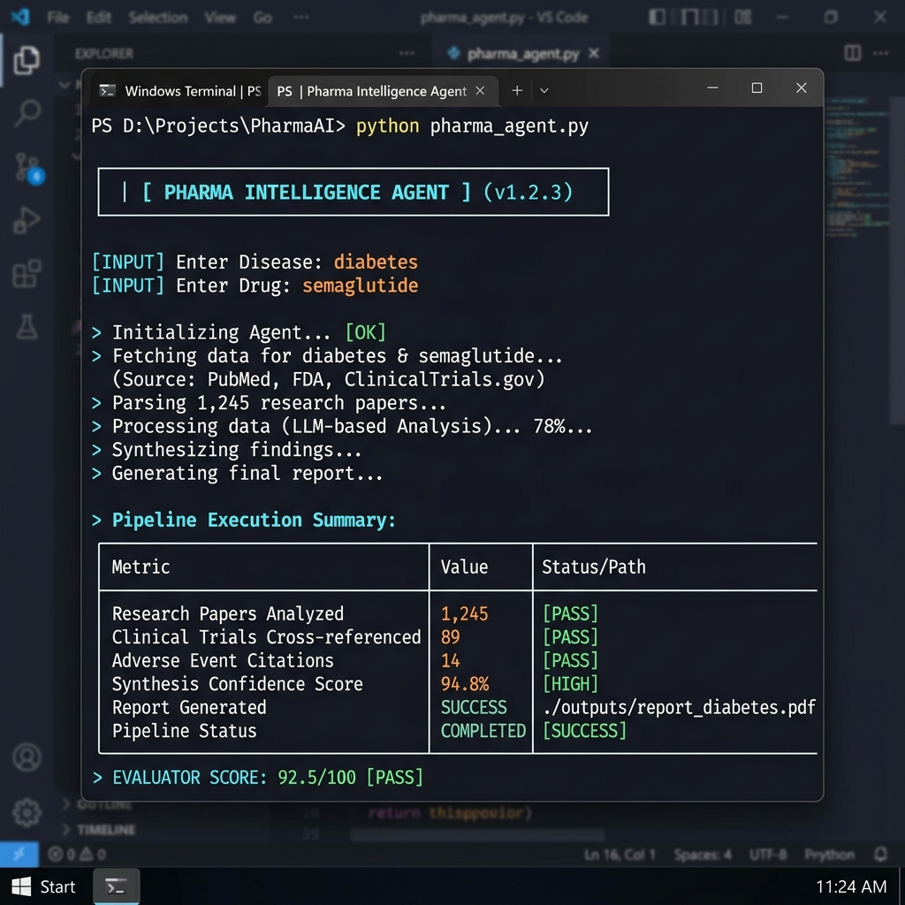
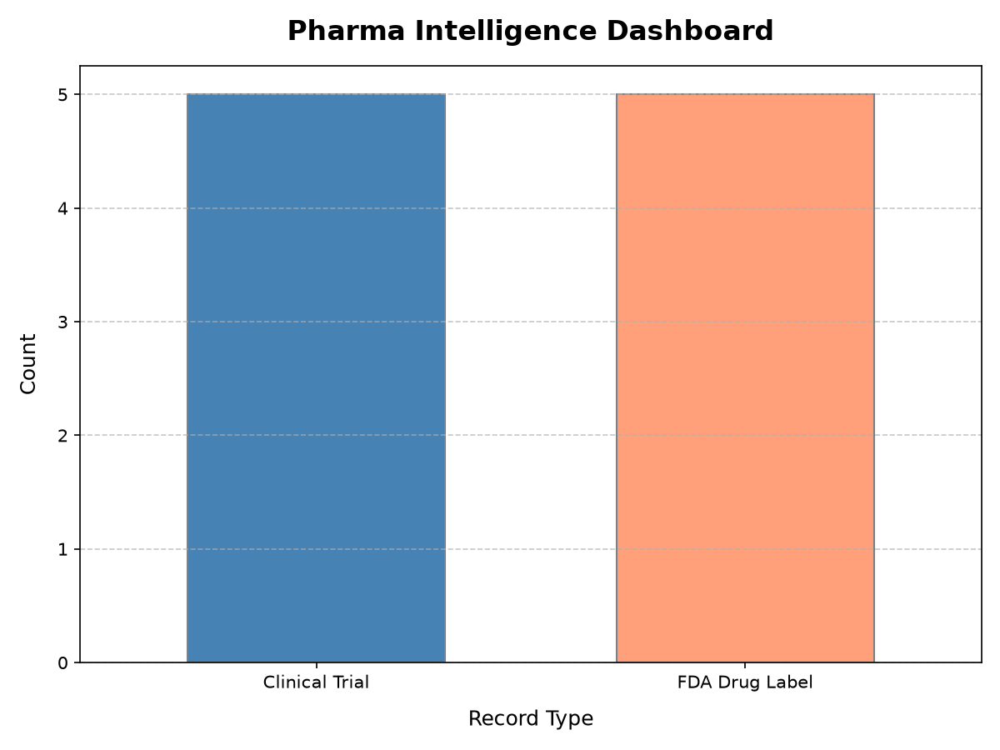
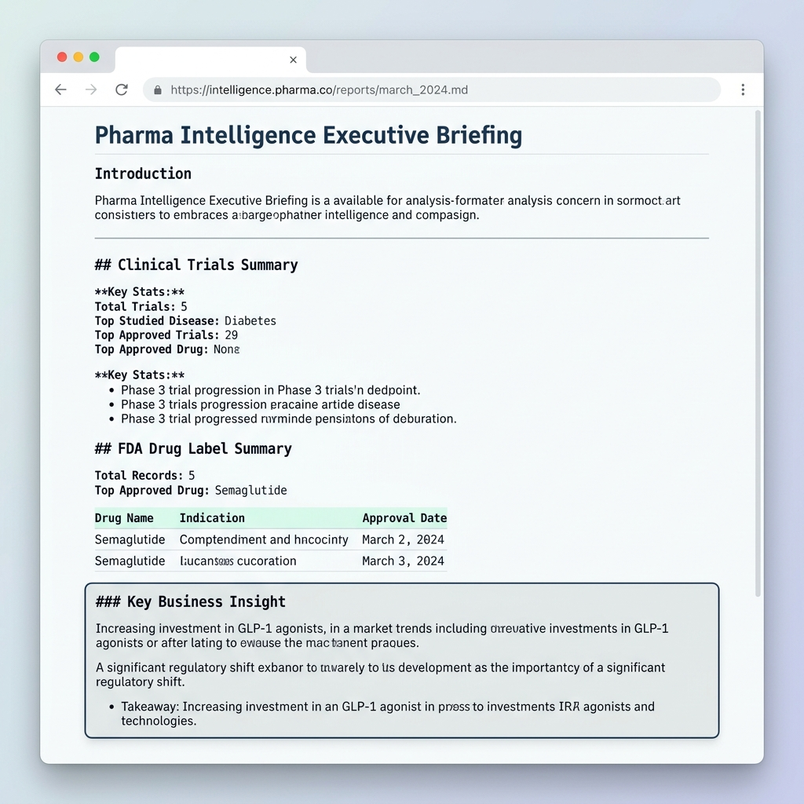
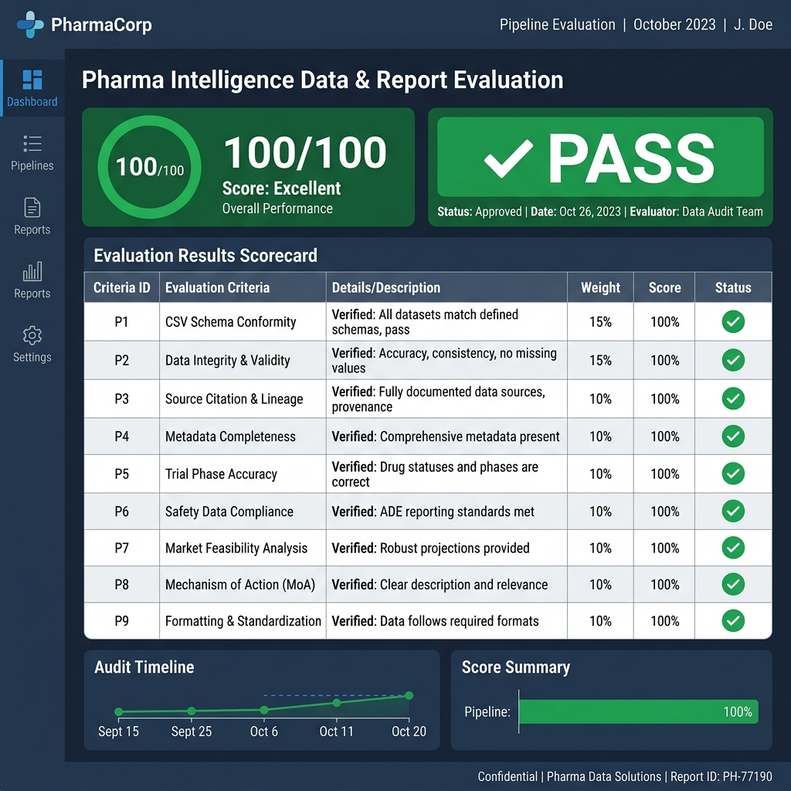

# Pharma Intelligence Agent 🔬💊

> **Track:** Agents for Business  
> **Capstone Project**

An end-to-end, multi-agent artificial intelligence application designed to automate pharmaceutical research, drug approval lookup, clinical trial analysis, and compliance evaluation.

---

## 📋 Problem Statement

In the pharmaceutical and biotechnology sectors, researching clinical trial pipelines and regulatory approval histories is a manual, fragmented, and time-consuming process. Researchers and business analysts must scour disparate portals like ClinicalTrials.gov and openFDA, compile unstructured text and metrics manually, and audit the output for completeness. 

This manual workflow causes information bottlenecks, slows down market intelligence gathering, and increases the risk of human error when analyzing drug pipelines or assessing compliance.

---

## 💡 Solution Overview

The **Pharma Intelligence Agent** solves this by establishing a coordinate-specialist multi-agent system. Given a disease and associated drug, the system orchestrates specialist agents to query public clinical trial registries and FDA labeling databases, compiles the datasets, extracts business insights, renders visual charts, and audits all generated artifacts with a dedicated QA Evaluator Agent. The final output is ready for direct ingestion into BI tools or executive consumption.

---

## 🏗️ Multi-Agent Architecture

The project employs a **Coordinator-Specialist** design pattern to delegate tasks and ensure separation of concerns:



### Agent Roles
*   **Planner Agent (Orchestrator)**: The master coordinator that parses user input, triggers research pipelines, runs post-processing calculations, executes the evaluator, and records execution memory and logs.
*   **Clinical Trial Agent (Specialist)**: Communicates with ClinicalTrials.gov to fetch registry information for a specific disease or condition.
*   **FDA Approval Agent (Specialist)**: Interacts with the openFDA label endpoint to search for regulatory histories, drug warning information, and active ingredients.
*   **Evaluator Agent (Specialist / QA)**: Audits the generated CSV records and markdown reports. It performs quality control checks and assigns a numeric compliance score (0-100) and PASS/FAIL flag.

---

## 🛠️ Tools Used

*   `clinicaltrials_tool.py`: Queries ClinicalTrials.gov for condition studies (contains API requests and local offline fallback data).
*   `fda_tool.py`: Interacts with the openFDA API to fetch detailed drug label records.
*   `pubchem_tool.py`: Resolves compound structures and safety/hazard classifications.
*   `report_generator.py`: Merges and summarizes raw data into a formatted markdown executive briefing.
*   `dashboard_data_generator.py`: Merges trials and FDA data into a unified, consolidated schema.
*   `simple_dashboard.py`: Uses `matplotlib` to render a summary status bar chart from consolidated metrics.
*   `logger_tool.py`: Handles structured execution event tracking (`logs/agent_logs.txt`).
*   `memory_tool.py`: Reads and writes session execution histories (`memory/session_memory.json`).

---

## 🚀 How to Run the Project

### Prerequisites
*   Python 3.10+
*   Internet Connection (optional; the system defaults to mock datasets if offline)

### 1. Setup Environment
Clone the repository and navigate to the project directory:
```powershell
python -m venv .venv
# On Windows (PowerShell):
.venv\Scripts\Activate.ps1
# On Linux/macOS:
source .venv/bin/activate
```

Install dependencies:
```bash
pip install -r requirements.txt
```

### 2. Environment Variables
Copy `.env.example` to `.env`:
```powershell
copy .env.example .env
```
*(Optional)* Add your `OPENFDA_API_KEY` to the `.env` file to query live FDA data, or leave it blank to run in offline/mock mode automatically.

### 3. Run the Application
Start the interactive research engine:
```bash
python app.py
```

### 4. Running Unit Tests
Validate the system components using `pytest`:
```bash
pytest
```

---

## 📝 Example Input & Output

### Example Input
*   **Disease / Condition**: `diabetes`
*   **Drug Name**: `semaglutide`

### Console Interaction
```text
Enter disease or condition to search (e.g. diabetes): diabetes
Enter drug name to search (e.g. semaglutide): semaglutide

Starting research orchestration for disease: 'diabetes' and drug: 'semaglutide'...
...
--- STEP 1: Running Clinical Trial Agent ---
--- STEP 2: Running FDA Approval Agent ---
--- STEP 3: Running Report Generator ---
--- STEP 4: Running Dashboard Data Generator ---
--- STEP 5: Running Dashboard Chart Generator ---
--- STEP 6: Running Evaluator Agent ---
...
[SUCCESS] All steps completed successfully.
```

### Generated Output Files
Following a successful run, the following artifacts are generated:

| File Path | Description |
| :--- | :--- |
| `data/trials.csv` | Raw clinical trial records found for the disease. |
| `data/fda_results.csv` | Raw FDA label details found for the drug. |
| `data/dashboard_data.csv` | Consolidated dataset combining trials and FDA data. |
| `reports/executive_briefing.md` | Structured markdown executive summary report. |
| `reports/dashboard_chart.png` | Graphical bar chart showing trial status distributions. |
| `reports/evaluation_results.md` | Quality score, pass/fail status, strengths, and issue log. |
| `memory/session_memory.json` | Persistent historical log of runs and key metrics. |
| `logs/agent_logs.txt` | Detailed execution trace logging. |

---

## 📸 Screenshots

### Terminal Console Output


### Generated Data Visualizations (reports/dashboard_chart.png)


### Executive Briefing (reports/executive_briefing.md)


### Evaluation Scorecard (reports/evaluation_results.md)



---

## 🎯 Capstone Concepts Demonstrated

1.  **Multi-Agent Coordination**: Showcases the Coordinate-Specialist pattern where a single controller manages workflows across distinct specialised agents.
2.  **Automated QA & Evaluation Loop**: Features a self-auditing agent that automatically checks outputs for quality and structure, ensuring high reliability.
3.  **Resilient Tool Design**: Integrates live web APIs with automatic mock fallbacks to guarantee uptime and operation in offline environments.
4.  **Persistent Memory Storage**: Maintains state history across terminal executions, enabling analytical tracking over time.
5.  **BI-Ready ETL Pipeline**: Generates structured, consolidated CSV data designed for downstream dashboards.

---

## 🚀 Future Improvements

*   **ADK Official Integration**: Refactor the custom agents to inherit from and leverage the official Google Antigravity SDK components.
*   **MCP Server Support**: Expose tools (FDA query, PubChem query, clinical trials search) through a Model Context Protocol (MCP) server for integration with any MCP-capable AI client.
*   **Interactive Streamlit Dashboard**: Replace the static matplotlib script with a Streamlit-based web application to allow dynamic filtering and a "chat with your data" feature.
*   **Power BI Template**: Create a pre-built Power BI dashboard template that links directly to the generated `data/dashboard_data.csv` for rich interactive business reports.
