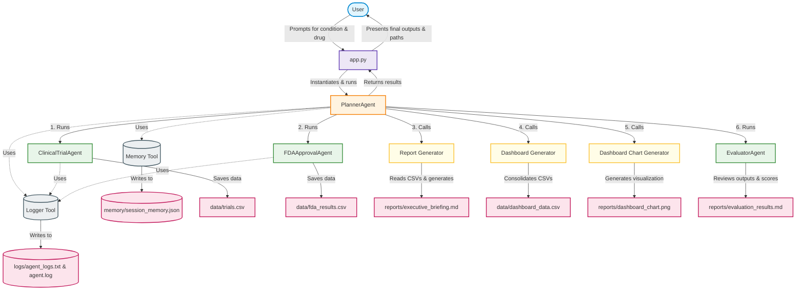

# Pharma Intelligence Agent Architecture

This document provides a beginner-friendly overview of the system architecture of the Pharma Intelligence Agent. It outlines the sequence of execution, the relationships between different agents and tools, and how data flows through the application.

## Workflow Overview

The application utilizes a **coordinator-agent pattern**. The execution flow is orchestrated by the [PlannerAgent](file:///c:/Users/nmano/pharma-intelligence-agent/agents/planner_agent.py), which coordinates fetching clinical trials, retrieving FDA drug approvals, synthesizing reports, building dashboard datasets, plotting charts, and running a final evaluation check.

---

## Component Breakdown

### 1. User Interface & Entry Point
- **[app.py](file:///c:/Users/nmano/pharma-intelligence-agent/app.py)**: The entry point for the user. It prompts the user to enter a disease condition (e.g., `diabetes`) and a drug name (e.g., `semaglutide`). It then forwards this to the planner agent and displays the final outcomes.

### 2. Orchestration Layer
- **[PlannerAgent](file:///c:/Users/nmano/pharma-intelligence-agent/agents/planner_agent.py)**: The central coordinator of the system. It coordinates the execution of sub-agents, runs reporting/dashboard utilities, invokes the Evaluator Agent, saves execution records to memory, and compiles the final success summary.

### 3. Sub-Agents
- **[ClinicalTrialAgent](file:///c:/Users/nmano/pharma-intelligence-agent/agents/clinical_trial_agent.py)**: Searches ClinicalTrials.gov for the target condition and saves the raw data to [data/trials.csv](file:///c:/Users/nmano/pharma-intelligence-agent/data/trials.csv).
- **[FDAApprovalAgent](file:///c:/Users/nmano/pharma-intelligence-agent/agents/fda_approval_agent.py)**: Queries the openFDA API for drug approval details, saving data to [data/fda_results.csv](file:///c:/Users/nmano/pharma-intelligence-agent/data/fda_results.csv).
- **[EvaluatorAgent](file:///c:/Users/nmano/pharma-intelligence-agent/agents/evaluator_agent.py)**: Acts as a quality-assurance agent. It reviews all generated CSVs and briefing reports, grades them, and saves the pass/fail report to [reports/evaluation_results.md](file:///c:/Users/nmano/pharma-intelligence-agent/reports/evaluation_results.md).

### 4. Generators (Tools)
- **[Report Generator](file:///c:/Users/nmano/pharma-intelligence-agent/tools/report_generator.py)**: Processes clinical trial data and FDA labels to construct the [reports/executive_briefing.md](file:///c:/Users/nmano/pharma-intelligence-agent/reports/executive_briefing.md).
- **[Dashboard Data Generator](file:///c:/Users/nmano/pharma-intelligence-agent/tools/dashboard_data_generator.py)**: Consolidates clinical trials and FDA records into a single unified CSV file at [data/dashboard_data.csv](file:///c:/Users/nmano/pharma-intelligence-agent/data/dashboard_data.csv).
- **[Dashboard Chart Generator](file:///c:/Users/nmano/pharma-intelligence-agent/tools/simple_dashboard.py)**: Creates visual representations of trial status and drug label metadata, saving a PNG chart to [reports/dashboard_chart.png](file:///c:/Users/nmano/pharma-intelligence-agent/reports/dashboard_chart.png).

### 5. Utilities (Memory & Logging)
- **[Memory Tool](file:///c:/Users/nmano/pharma-intelligence-agent/tools/memory_tool.py)**: Handles reading and appending workflow details to a JSON session memory store at [memory/session_memory.json](file:///c:/Users/nmano/pharma-intelligence-agent/memory/session_memory.json).
- **[Logger Tool](file:///c:/Users/nmano/pharma-intelligence-agent/tools/logger_tool.py)**: Appends event logs (timestamp, agent, task, status, message) to [logs/agent_logs.txt](file:///c:/Users/nmano/pharma-intelligence-agent/logs/agent_logs.txt).
