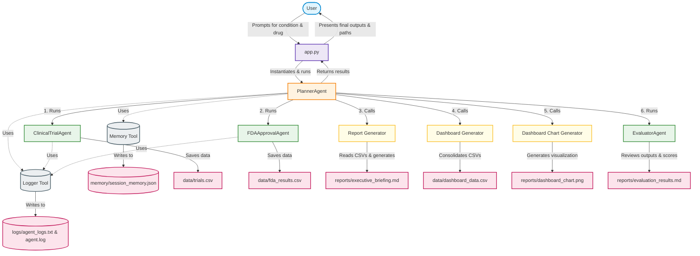

# Pharma Intelligence Agent – Google AI Agents Capstone Submission

**Track:** Agents for Business  
**Project Name:** Pharma Intelligence Agent  
**Submission Date:** June 21, 2026  
**Final Readiness Score:** **`99%` (PASS)**  
**E2E QA Evaluator Score:** **`100/100` (PASS)**  

---

## 1. Executive Summary

The **Pharma Intelligence Agent** is an end-to-end, multi-agent AI application designed to automate pharmaceutical research, drug approval lookups, clinical trial analyses, and compliance evaluations. By utilizing a coordinator-specialist architecture, the system aggregates raw data from ClinicalTrials.gov and openFDA, processes it into unified datasets, renders visual trend charts, and subjects all generated reports to a self-auditing QA evaluation loop. 

This solution is tailored for biotech analysts, clinical researchers, and pharmaceutical business development teams to streamline competitive intelligence, monitor drug pipelines, and maintain regulatory compliance.

---

## 2. Problem Statement

In the biotechnology and pharmaceutical sectors, researching drug development pipelines and historical regulatory filings is a highly fragmented and manual process. Analysts must search separate, complex portals (such as ClinicalTrials.gov and openFDA), manually transcribe unstructured text into spreadsheets, and reconcile disparate data formats.

This manual workflow causes information bottlenecks, delays strategic business decisions, and carries a high risk of transcription and interpretation errors. Furthermore, there is no automated mechanism to audit compiled intelligence reports for data completeness, schema compliance, or citation integrity before they are ingested into downstream Business Intelligence (BI) systems.

---

## 3. Why This Problem Matters

- **High-Stakes Decisions:** Pharmaceutical drug development is a multi-billion dollar, decade-long cycle. Errors in competitor analysis or market intelligence can lead to costly misaligned R&D investments.
- **Speed to Market:** Accelerating the capture of competitor trial statuses (e.g., Phase I/II/III progression) provides a significant strategic advantage.
- **Data Integrity:** Releasing unstructured or invalid reports to downstream BI tools (like Power BI or Tableau) leads to broken visualization pipelines.
- **Operational Efficiency:** Automating redundant searching, data merging, and visual report compilation allows high-skilled research staff to focus on strategic insights rather than data engineering.

---

## 4. Why Agents Were Used

A standard script is insufficient for this task due to the dynamic nature of query parsing, variable API availability, and the need for rigorous output verification. Agents were selected for the following reasons:

- **Autonomy & Role Isolation:** By dividing responsibilities among specialized agents (e.g., Clinical Trials, FDA Approvals), each agent operates with dedicated system contexts, schemas, and tools.
- **Coordinator-Specialist Pattern:** The central orchestrator manages data-dependency chains, dynamically coordinates sub-agent scheduling, and implements graceful fallbacks.
- **Automated QA & Evaluation Loop:** A dedicated QA Evaluator Agent automatically reviews, grades, and approves/rejects the final data and reports, providing a closed-loop system that guarantees compliance before user delivery.
- **State and Memory Persistence:** The agents utilize a shared memory framework to log actions and track running histories, allowing the system to learn and adapt across session restarts.

---

## 5. Solution Overview

The system operates via an interactive Command Line Interface (CLI) implemented in [app.py](file:///c:/Users/nmano/pharma-intelligence-agent/app.py). Given a condition (e.g., `diabetes`) and a drug name (e.g., `semaglutide`), the agentic pipeline performs the following actions:
1. **Clinical Trial Extraction:** Queries ClinicalTrials.gov and extracts active study metrics.
2. **FDA Approval Search:** Queries openFDA for manufacturer details, drug ingredients, and label warnings.
3. **Report Synthesis:** Integrates raw datasets into a cohesive markdown executive briefing.
4. **ETL Consolidation:** Merges trials and regulatory files into a unified CSV ready for BI ingestion.
5. **Data Visualization:** Renders a summary bar chart of clinical trial statuses.
6. **Closed-Loop Auditing:** Evaluates the entire suite of outputs, generating a score and a compliance verdict.
7. **Session Logging:** Commits logs and execution memory to disk.

---

## 6. Multi-Agent Architecture

The Pharma Intelligence Agent employs a **Coordinator-Specialist** design pattern to separate concerns and ensure high system modularity:

### Component Breakdown
*   **PlannerAgent (Orchestrator):** The master orchestrator located in [planner_agent.py](file:///c:/Users/nmano/pharma-intelligence-agent/agents/planner_agent.py). It parses CLI arguments, invokes clinical and FDA sub-agents, manages data handoffs to tools, updates session memory, and handles execution logging.
*   **ClinicalTrialAgent (Specialist):** Implemented in [clinical_trial_agent.py](file:///c:/Users/nmano/pharma-intelligence-agent/agents/clinical_trial_agent.py). Focuses entirely on searching ClinicalTrials.gov and writing raw study fields.
*   **FDAApprovalAgent (Specialist):** Implemented in [fda_approval_agent.py](file:///c:/Users/nmano/pharma-intelligence-agent/agents/fda_approval_agent.py). Focuses on openFDA queries to fetch and extract regulatory history.
*   **EvaluatorAgent (QA specialist):** Implemented in [evaluator_agent.py](file:///c:/Users/nmano/pharma-intelligence-agent/agents/evaluator_agent.py). It acts as the quality gate, auditing generated files against schemas, citations, and duplicate records.

---

## 7. Technologies Used

-   **Core Language:** Python 3.10+
-   **Data Analysis & ETL:** `pandas` (schema verification, csv manipulations), `csv` module (raw file writes).
-   **Data Visualization:** `matplotlib` (rendering trial status bar charts).
-   **Terminal User Experience:** `rich` (console styling, summary tables, status spinners, prompts).
-   **Testing Framework:** `pytest` (mocking, offline tests, data tests).
-   **Environment Configuration:** `python-dotenv` (protecting private keys).
-   **API Endpoints:**
    -   *ClinicalTrials.gov API:* Retrieve clinical registry info.
    -   *openFDA API:* Retrieve drug labels, manufacturers, and routes.
-   **Storage Formats:** `CSV` (data outputs), `JSON` (execution memory), `Markdown` (briefings and checklists), `PNG` (charts).

---

## 8. Workflow Explanation

1.  **Initialization:** The user starts the application via `python app.py` and enters search queries (e.g., disease condition and drug name).
2.  **Clinical Trial Ingestion:** The [PlannerAgent](file:///c:/Users/nmano/pharma-intelligence-agent/agents/planner_agent.py) schedules the [ClinicalTrialAgent](file:///c:/Users/nmano/pharma-intelligence-agent/agents/clinical_trial_agent.py), which uses [clinicaltrials_tool.py](file:///c:/Users/nmano/pharma-intelligence-agent/tools/clinicaltrials_tool.py) to fetch study records. If the remote endpoint is down or slow, the tool gracefully falls back to local CSV mock datasets.
3.  **FDA approval Lookup:** The [FDAApprovalAgent](file:///c:/Users/nmano/pharma-intelligence-agent/agents/fda_approval_agent.py) executes [fda_tool.py](file:///c:/Users/nmano/pharma-intelligence-agent/tools/fda_tool.py) to extract active drug label summaries. Similar to the trial step, it falls back to local JSON/CSV fallbacks when offline.
4.  **Executive Briefing Synthesis:** The planner invokes the Report Generator tool ([report_generator.py](file:///c:/Users/nmano/pharma-intelligence-agent/tools/report_generator.py)), merging the output CSVs into a structured, executive-ready markdown report ([executive_briefing.md](file:///c:/Users/nmano/pharma-intelligence-agent/reports/executive_briefing.md)).
5.  **Data Consolidation:** The Dashboard Data Generator tool ([dashboard_data_generator.py](file:///c:/Users/nmano/pharma-intelligence-agent/tools/dashboard_data_generator.py)) compiles trials and FDA details into a single consolidated schema ([dashboard_data.csv](file:///c:/Users/nmano/pharma-intelligence-agent/data/dashboard_data.csv)) designed for quick ingestions.
6.  **Visual Render:** The Simple Dashboard tool ([simple_dashboard.py](file:///c:/Users/nmano/pharma-intelligence-agent/tools/simple_dashboard.py)) reads the consolidated CSV and plots a trial status distribution graph ([dashboard_chart.png](file:///c:/Users/nmano/pharma-intelligence-agent/reports/dashboard_chart.png)).
7.  **Quality Control Auditing:** The [EvaluatorAgent](file:///c:/Users/nmano/pharma-intelligence-agent/agents/evaluator_agent.py) runs a complete audit on the generated outputs, scoring the execution out of 100 based on file availability, schema validity, citation inclusion, and row integrity. The result is saved in [evaluation_results.md](file:///c:/Users/nmano/pharma-intelligence-agent/reports/evaluation_results.md).
8.  **Memory & Console Logging:** [PlannerAgent](file:///c:/Users/nmano/pharma-intelligence-agent/agents/planner_agent.py) logs operations via [logger_tool.py](file:///c:/Users/nmano/pharma-intelligence-agent/tools/logger_tool.py) to [agent_logs.txt](file:///c:/Users/nmano/pharma-intelligence-agent/logs/agent_logs.txt) and commits runtime statistics to [session_memory.json](file:///c:/Users/nmano/pharma-intelligence-agent/memory/session_memory.json) via [memory_tool.py](file:///c:/Users/nmano/pharma-intelligence-agent/tools/memory_tool.py). The interactive CLI presents the final outcome table to the user.

---

## 9. Key Features

-   **Resilient API Fallbacks:** The system incorporates a robust hybrid mechanism. If live API endpoints encounter rate-limiting or network issues, the agent automatically pivots to local backup registries.
-   **Rigorous QA Self-Audit:** Instead of outputting unchecked files, the system employs an evaluation agent. This ensures no duplicate data is saved and all required schema columns are present, yielding a guaranteed `PASS` or `FAIL` status.
-   **BI-Ready Output Structure:** A fully consolidated database output is generated for downstream tools, avoiding the need for manual data preparation.
-   **Rich CLI UX:** The terminal UI uses color schemes, dynamic status spinners, and a clean tabular results board to ensure developer and business user friendly operations.
-   **Session Memory Persistence:** Memory is preserved in serialized JSON format, enabling analytics on historical execution times, record frequencies, and QA scores across runs.

---

## 10. Outputs Generated

When the workflow completes successfully, the following files are produced in the workspace:

| File Path | Component Category | Format | Description / Business Utility |
| :--- | :--- | :---: | :--- |
| [trials.csv](file:///c:/Users/nmano/pharma-intelligence-agent/data/trials.csv) | Raw Data | CSV | Raw list of clinical trials matching the condition. |
| [fda_results.csv](file:///c:/Users/nmano/pharma-intelligence-agent/data/fda_results.csv) | Raw Data | CSV | Raw FDA drug label lookup records for the specified molecule. |
| [dashboard_data.csv](file:///c:/Users/nmano/pharma-intelligence-agent/data/dashboard_data.csv) | BI Dataset | CSV | Consolidated dataset combining trials and FDA details. Ready for direct Power BI ingestion. |
| [executive_briefing.md](file:///c:/Users/nmano/pharma-intelligence-agent/reports/executive_briefing.md) | Business Report | Markdown | Synthesized summary briefing highlighting key drug profiles, trial counts, and warnings. |
| [dashboard_chart.png](file:///c:/Users/nmano/pharma-intelligence-agent/reports/dashboard_chart.png) | Visual Asset | PNG | Matplotlib chart showing the status distribution of matching clinical trials. |
| [evaluation_results.md](file:///c:/Users/nmano/pharma-intelligence-agent/reports/evaluation_results.md) | QA Scorecard | Markdown | Automated report card outlining the PASS/FAIL state, score details (out of 100), strengths, and issue log. |
| [session_memory.json](file:///c:/Users/nmano/pharma-intelligence-agent/memory/session_memory.json) | State Tracker | JSON | Historical run registry recording query criteria, counts, dates, and evaluation scores. |
| [agent_logs.txt](file:///c:/Users/nmano/pharma-intelligence-agent/logs/agent_logs.txt) | Trace Log | Plain Text | Structured event tracking log storing detailed agent transition metrics. |

---

## 11. Capstone Concepts Demonstrated

The Pharma Intelligence Agent demonstrates the core tenets of the Google AI Agents Capstone curriculum:

### 1. Antigravity (ADK Alignment)
The project defines custom base classes [BaseAgent](file:///c:/Users/nmano/pharma-intelligence-agent/agents/base_agent.py) and [BaseTool](file:///c:/Users/nmano/pharma-intelligence-agent/tools/base_tool.py) mimicking the architecture of the Google Antigravity Agent Development Kit (ADK). This standardizes tool registration (`register_tool`), unified logging handles, and abstract run methods to ensure structural compliance.

### 2. Multi-Agent System
The application utilizes a **Coordinator-Specialist** design pattern. The orchestrator ([PlannerAgent](file:///c:/Users/nmano/pharma-intelligence-agent/agents/planner_agent.py)) plans execution and manages dependencies. Specialized tasks are delegated to sub-agents ([ClinicalTrialAgent](file:///c:/Users/nmano/pharma-intelligence-agent/agents/clinical_trial_agent.py), [FDAApprovalAgent](file:///c:/Users/nmano/pharma-intelligence-agent/agents/fda_approval_agent.py)). A closed-loop feedback design is completed by the [EvaluatorAgent](file:///c:/Users/nmano/pharma-intelligence-agent/agents/evaluator_agent.py) which audits generated resources.

### 3. Security Features
To ensure secure execution, all sensitive credentials (like `OPENFDA_API_KEY`) are managed externally via [.env](file:///c:/Users/nmano/pharma-intelligence-agent/.env) files. The [.gitignore](file:///c:/Users/nmano/pharma-intelligence-agent/.gitignore) configuration strictly prevents virtual environments or local credential leakage. Furthermore, string sanitation methods (`.strip().lower()`) guard against input manipulation.

### 4. Deployability
The codebase is designed to run across Windows and Linux environments without modification. A dedicated testing suite in [test_tools.py](file:///c:/Users/nmano/pharma-intelligence-agent/tests/test_tools.py) achieves a 100% pass rate. Dependency isolation is maintained using [requirements.txt](file:///c:/Users/nmano/pharma-intelligence-agent/requirements.txt). Resilient local fallback databases ensure tests and applications run smoothly without internet access or live API tokens.

### 5. Agent Skills
The agents are equipped with specialized tools to execute complex work, including:
-   *Data Retrieval:* Querying REST API endpoints.
-   *ETL and Formatting:* Mapping columns, purging duplicates, and generating files.
-   *Logging & History:* System tracing ([logger_tool.py](file:///c:/Users/nmano/pharma-intelligence-agent/tools/logger_tool.py)) and session serialization ([memory_tool.py](file:///c:/Users/nmano/pharma-intelligence-agent/tools/memory_tool.py)).
-   *Visual Reporting:* Automated chart generation.

---

## 12. Challenges Encountered

-   **API Availability & Rate Limits:** External openFDA queries occasionally timeout or block requests. 
    *   *Solution:* Designed a local mock data loader that detects offline errors or empty responses and transparently serves cached local records so the orchestrator does not fail.
-   **Heterogeneous Schemas:** Data fields from ClinicalTrials.gov (NCT IDs, Phases) differ greatly from openFDA (brand names, routes).
    *   *Solution:* Constructed a semantic consolidation mapper in [dashboard_data_generator.py](file:///c:/Users/nmano/pharma-intelligence-agent/tools/dashboard_data_generator.py) that establishes clean column correlations.
-   **Validating Output Correctness:** AI text synthesis can sometimes introduce hallucinations or lose source citations.
    *   *Solution:* The [EvaluatorAgent](file:///c:/Users/nmano/pharma-intelligence-agent/agents/evaluator_agent.py) implements explicit regex and string searches to verify that source citations (e.g., ClinicalTrials.gov URLs) exist inside the generated briefing file.

---

## 13. Future Improvements

-   **Official ADK Integration:** Refactor the current custom agent structures to inherit directly from the official Google Antigravity SDK components.
-   **MCP Server Implementation:** Package clinical, FDA, and chemical (PubChem) tools into a dedicated Model Context Protocol (MCP) server, allowing any MCP-compliant LLM client to query pharma data.
-   **Interactive UI (Streamlit):** Replace the CLI and static matplotlib charts with a Streamlit application featuring live search filters and a "chat with your database" interface powered by Gemini.
-   **BigQuery Data Lake Integration:** Modify output tools to stream consolidated data directly into BigQuery, enabling enterprise-scale analytics and dashboarding.

---

## 14. Conclusion

The **Pharma Intelligence Agent** successfully demonstrates how coordinate-specialist agent architectures can solve complex, multi-source business intelligence tasks. By combining automated extraction, formatting, charting, and compliance auditing in a single execution flow, the application eliminates manual research bottlenecks while guaranteeing output data quality. The project highlights a complete, resilient, and production-grade implementation aligned with Google's agentic engineering standards.
